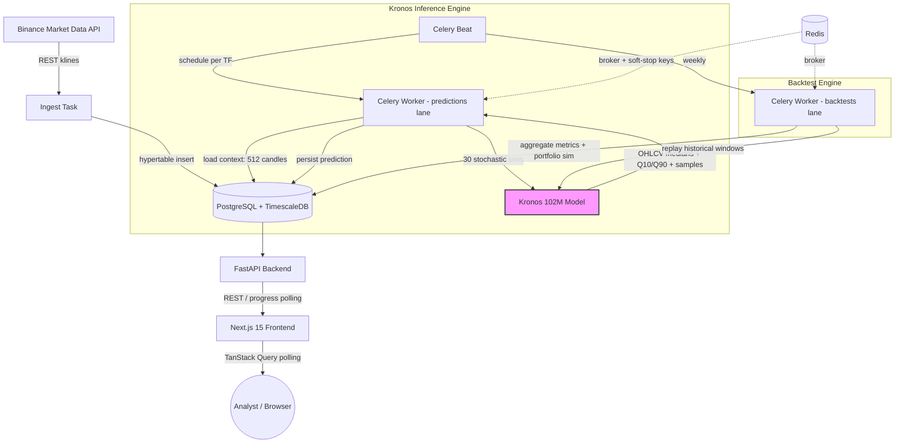

# bitPredict 📈

### A multi-timeframe Bitcoin forecasting platform powered by Kronos — NeoQuasar's 102M-parameter foundation model for financial time series.

<p align="center">
  <a href="https://www.linkedin.com/in/leonardo-barretti/">
    
  </a>
  <a href="mailto:lbarretti@gmail.com">
    
  </a>
</p>

<p align="center">
  
  
  
  
  
  
  
  
  
  
</p>

---

## 🌐 Live Application

bitPredict runs in production on a dedicated VPS, ingesting live Binance data and producing fresh forecasts every 15 minutes across six timeframes.

> [!IMPORTANT]
> **Want to test the platform?**
> Access is restricted for cost and infrastructure management (GPU-bound inference, real-time Binance ingestion). If you are a recruiter, quant developer, or trading professional and would like a demo account, please **contact me directly** at [lbarretti@gmail.com](mailto:lbarretti@gmail.com) with the subject line *"bitPredict Demo Access"*.

---

## 🚩 The Problem

Retail-grade Bitcoin "prediction" tools are mostly indicator soup — RSI crossovers, moving-average ribbons, Twitter sentiment dashboards. None of them tell you what an analyst actually needs to know:

- *"What's the realistic price range for the next candle, and how confident is the model?"*
- *"When the model says 70%+ bullish, how often is it actually right?"*
- *"If I had traded this signal mechanically for the last six months, what would my equity curve look like?"*

Classic deep-learning pipelines (LightGBM + LSTM + N-BEATS + TFT ensembles) can answer some of this, but they come with a heavy operational tax: periodic retraining, drift monitoring, MLflow registries, feature stores, model rollback strategies. For a single-asset, single-target forecast, the overhead dwarfs the marginal accuracy gain.

## 🧠 The Approach

bitPredict explores a different hypothesis: **what if a single, frozen foundation model could replace the whole ensemble?**

Kronos is a 102M-parameter transformer pre-trained by NeoQuasar specifically on financial time series. Instead of retraining, bitPredict runs **30 stochastic simulations per candle** — each a slightly different sampled future. That cloud of simulations becomes the forecast:

- **Median across 30 runs** → expected OHLCV
- **Q10 / Q90 across 30 runs** → 80% confidence band (natural, not learned)
- **Fraction of bullish simulations** → directional consensus
- **Full distribution of closes** → analyst-style histogram

No retraining. No drift dashboards. No model registry. Just inference, validation, and an honest backtest.

A second, completely independent strategy — **RSI-2 mean-reversion** — runs in parallel on a separate dashboard, kept around because it's been profitable and there's no reason to break what works.

---

## ✨ Core Features

### Forecasting Engine
- **Six independent timeframes** — 15m · 1h · 4h · 8h · 1d · 1w UTC, each with its own Celery beat schedule and prediction lane.
- **Stochastic confidence bands** — 30 simulations per candle yield Q10/Q90 natively, without quantile regression heads.
- **Auto-validation** — Every prediction is matched against the actual closed candle: directional hit/miss, MAPE on close/high/low/volume, high-confidence calibration (when ≥70% confident, how often correct?).
- **Backtest engine** — Replay historical windows with portfolio simulation: initial capital, position sizing, compound interest, drawdown tracking.

### Platform Features
- 🔄 **Real-time progress tracking** — Per-sample + per-simulation progress, rolling-average ETA, soft-stop mechanism via Redis key (cancel mid-run without killing the worker).
- 📊 **Two-column analyst dashboard** — Price targets, directional consensus, live candle ticker, 10-bucket analyst-distribution histogram with bezier overlay, scoreboard, history table.
- 📐 **Independent strategies, isolated routes** — Kronos on `/`, RSI-2 on `/rsi2`. RSI-2 stays in Portuguese for its original audience; Kronos is fully English.
- 🐳 **Containerized end-to-end** — Docker Compose orchestrates Postgres + TimescaleDB, Redis, FastAPI backend, Celery worker/beat, Flower, and Next.js frontend.

### Engineering
- ✅ **Type safety end-to-end** — Pydantic v2 + SQLAlchemy 2.0 on the server, Zod + TypeScript on the client. Contracts enforced at every boundary.
- 🗃️ **TimescaleDB hypertables** — Klines, predictions, and backtest results stored as time-series-optimized tables. Compressed, partitioned, fast.
- 🧪 **Alembic-managed schema** — Every database change is a versioned migration; production startup runs `alembic upgrade head` automatically.
- 🛰️ **Geo-resilient ingestion** — Switchable Binance base URL (`api.binance.com` vs `data-api.binance.vision`) for VPS providers that hit HTTP 451 geo-blocks.

---

## 🏗️ Architecture



### Why This Stack?

| Component | Technology | Why |
|---|---|---|
| **Forecast Model** | **Kronos (NeoQuasar, 102M)** | Frozen foundation model: zero retraining, multi-TF coverage out of the box, natural uncertainty via sampling. |
| **Time-Series DB** | **PostgreSQL + TimescaleDB** | Hypertables + native compression for millions of candles and predictions; one source of truth for OLTP + analytics. |
| **Task Queue** | **Celery + Redis** | Two independent lanes (`predictions` high-priority, `backtests` long-running). Soft-stop via Redis key without killing workers. |
| **API Framework** | **FastAPI + Pydantic v2** | Async, automatic OpenAPI, contract-first validation between worker → API → frontend. |
| **Frontend** | **Next.js 15 (App Router) + React 19** | Server Components, file-based routing, isolated `/rsi2` legacy route untouched during Kronos refactor. |
| **Charting** | **lightweight-charts + custom SVG** | Lightweight-charts for OHLC; custom SVG histogram for the analyst-distribution view (gradient buckets + bezier curve overlay). |
| **State** | **TanStack Query v5** | Polling, optimistic updates, mutation tracking for trigger/stop endpoints. |

### Key Endpoints

**Kronos:**
- `GET  /kronos/prediction/{timeframe}` — Active prediction (medians, Q10/Q90, prob_bullish, target candle)
- `GET  /kronos/history/{timeframe}` — Paginated history with predicted vs actual + error %
- `GET  /kronos/backtest/{timeframe}` — Most recent backtest metrics + portfolio results
- `GET  /kronos/health` — Aggregate worker state + last prediction/ingest per timeframe
- `GET  /kronos/progress/{timeframe}` — Live task progress (step, sample/sim counts, ETA)
- `POST /kronos/prediction/{timeframe}/trigger` — Manual inference
- `POST /kronos/prediction/{timeframe}/stop` — Soft-stop running task
- `POST /kronos/backtest/{timeframe}/trigger` — Manual backtest run

**RSI-2 (legacy strategy):**
- `GET  /rsi2/signal/{timeframe}`, `GET /rsi2/trades`, `GET /rsi2/health`

**System:** `GET /health`, `GET /readiness`, `GET /docs` (Swagger)

---

## 🎓 How the Forecast Works

For each timeframe, every scheduled cycle does the following:

1. **Ingest** — Pull the latest closed candle from Binance into the TimescaleDB hypertable.
2. **Context window** — Load the last **512 candles** as model context.
3. **Stochastic sampling** — Run Kronos **30 times** with temperature 0.8. Each run produces one full sampled OHLCV future for the next candle.
4. **Aggregate** —
   ```
   expected_close   = median(close across 30 sims)
   q10, q90         = 10th and 90th percentile of close
   prob_bullish     = fraction of sims with close > open
   distribution     = 10-bucket histogram of all 30 closes
   ```
5. **Persist** — Write to `kronos_predictions` with the target candle's open/close timestamps.
6. **Validate later** — A `fill_actuals` task runs every 5 minutes; once the target candle has closed, it backfills the actual OHLCV and computes directional hit, MAPE, and calibration.

### High-Confidence Calibration

The most important metric for an analyst isn't raw accuracy — it's **calibrated confidence**. bitPredict reports:

> *"Directional accuracy 63%. But when the model was ≥70% confident (either way), it was right 71% of the time — and that happened on 38 of the last 50 samples."*

That's the signal a discretionary trader actually uses: *when does the model deserve to be trusted?*

---

## 🚀 Getting Started

### Prerequisites
- Docker & Docker Compose
- HuggingFace token (for the one-time Kronos weights download)
- *Optional:* Binance API credentials (defaults to anonymous public endpoints)

### Quick Start

```bash
# 1. Clone
git clone https://github.com/leopbar/bitPredict.git
cd bitPredict

# 2. Configure environment
cp backend/.env.example backend/.env
# edit backend/.env — set HUGGINGFACE_TOKEN, API_KEY, etc.

# 3. Bring the stack up
docker compose up -d

# 4. Verify infrastructure
docker compose exec backend bitpredict smoke

# 5. Verify Kronos model + data freshness
docker compose exec backend bitpredict kronos smoke
```

Access locally:
- **Dashboard** → http://localhost:3000
- **API docs (Swagger)** → http://localhost:8000/docs
- **Flower (Celery monitor)** → http://localhost:5555

### Production Deployment

A production-ready `docker-compose.prod.yml` and `deploy/` scripts are included. They handle:
- Geo-blocked Binance regions (via `BINANCE_BASE_URL=data-api.binance.vision`)
- Build-time bake of `NEXT_PUBLIC_*` env vars into the Next.js bundle
- Automatic `alembic upgrade head` on backend startup
- Named volumes for `node_modules`, `.next`, and venv (mandatory when the working copy lives on OneDrive or any sync filesystem)

See `.env.production.example` for the full production config surface.

---

## 📁 Project Structure

```text
bitPredict/
├── backend/
│   └── src/bitpredict/
│       ├── kronos/              # Inference engine
│       │   ├── loader.py        # Model + tokenizer caching
│       │   ├── inference.py     # 30-sim stochastic forecast
│       │   ├── timeframes.py    # Timeframe enum + interval math
│       │   ├── service.py       # Orchestration
│       │   ├── tasks.py         # Celery tasks (predict + backtest)
│       │   └── backtest.py      # Historical replay + portfolio sim
│       ├── strategies/rsi2/     # Legacy RSI-2 mean-reversion (PT-BR)
│       ├── api/routes/          # FastAPI routers (kronos, rsi2, health)
│       ├── scheduling/          # Celery beat schedules
│       ├── data/                # Binance client + historical ingest
│       └── cli/                 # Typer-based ops CLI
├── frontend/
│   ├── app/
│   │   ├── page.tsx             # Kronos dashboard (main)
│   │   ├── backtest/            # Backtest UI
│   │   └── rsi2/                # RSI-2 dashboard (legacy, PT-BR)
│   ├── components/kronos/       # 11 dashboard cards (SVG histogram, etc.)
│   └── lib/hooks/               # TanStack Query + countdown hooks
├── deploy/                      # VPS deploy scripts (deploy.sh, setup.sh)
├── docker-compose.yml           # Local dev
├── docker-compose.prod.yml      # Production
└── alembic/versions/            # Schema migrations
```

---

## 📐 Key Design Decisions

- **Foundation model over ensemble.** A single frozen 102M-parameter Kronos model replaces the Phase A 4-model ensemble (LightGBM + LSTM + N-BEATS + TFT). Zero retraining, 6 timeframes for the price of 1, natural uncertainty from sampling instead of learned quantile heads.
- **Stochastic confidence bands.** Q10/Q90 come from the empirical distribution of 30 sampled futures, not from a separately-trained quantile regressor. Simpler to reason about, simpler to calibrate.
- **Two isolated Celery lanes.** `predictions` (high-priority, sub-minute) and `backtests` (low-priority, multi-hour) run on separate workers so a 1d backtest can't block the 15m prediction cycle.
- **Soft-stop via Redis key.** Long-running inference checks a Redis flag between simulations. The Stop button on the UI sets the key — no `SIGKILL`, no orphaned model state, no dead Celery workers.
- **Phase B (RSI-2) frozen.** A working strategy with a Portuguese-speaking audience. Untouched during the Kronos rebuild — different route, different language, different code path. Don't break what already prints money.
- **Named Docker volumes for build caches.** The repo lives in OneDrive on the dev machine. `node_modules`, `.next`, and the Python venv must live in named volumes; otherwise OneDrive sync silently corrupts builds with `EACCES` errors and stale bundles.
- **Geo-resilient Binance client.** Many VPS providers get HTTP 451 from `api.binance.com`. The base URL is a config knob, defaulting to `data-api.binance.vision` (Binance's public market-data mirror) in production.

---

## 🚧 Roadmap

- [x] Backend cleanup of Phase A deep-learning ensemble (deleted 2026-05-18)
- [x] Multi-timeframe Kronos inference engine (6 TFs, isolated Celery lanes)
- [x] Nine REST endpoints (prediction, history, backtest, health, progress, trigger, stop)
- [x] Kronos analyst dashboard (price targets, consensus, distribution histogram, scoreboard)
- [x] Backtest engine with portfolio simulation
- [x] Production VPS deployment with geo-resilient Binance ingestion
- [ ] **Timeframe selector** on the main dashboard (currently hardcoded 15m view)
- [ ] **Advanced settings dialog** (sample_count, temperature, model variant override)
- [ ] **Integrated backtest UI** — fold the standalone `/backtest` page into the main dashboard
- [ ] **Weekly backtest schedule** — automatic refresh via Celery beat
- [ ] **Alerting** — webhook / email when calibrated confidence crosses a threshold
- [ ] **GPU inference** — currently CPU-only; GPU support would bring 1w predictions under 30s

---

## 👤 Author

Built by **Leonardo P Barretti**
[lbarretti@gmail.com](mailto:lbarretti@gmail.com) · [LinkedIn](https://www.linkedin.com/in/leonardo-barretti/)

**Open to partnerships, deep technical conversations, or a demo walkthrough.** Reach out via email or LinkedIn — happy to talk about foundation models for finance, Celery at scale, or the day-to-day reality of running ML in production on a single VPS.

## 📄 License

Released under the [MIT License](LICENSE).
